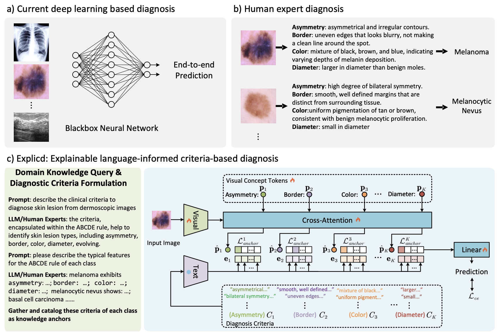

# Explicd: Explainable Language-Informed Criteria-based Diagnosis

This repository contains the official implementation of "[Aligning Human Knowledge with Visual Concepts Towards Explainable Medical Image Classification (MICCAI 2024 Early Accept)](https://arxiv.org/abs/2406.05596)"

## Abstract

Although explainability is essential in the clinical diagnosis, most deep learning models still function as black boxes without elucidating their decision-making process. In this study, we investigate the explainable model development that can mimic the decision-making process of human experts by fusing the domain knowledge of explicit diagnostic criteria. We introduce a simple yet effective framework, Explicd, towards Explainable language-informed criteria-based diagnosis. Explicd initiates its process by querying domain knowledge from either large language models (LLMs) or human experts to establish diagnostic criteria across various concept axes (e.g., color, shape, texture, or specific patterns of diseases). By leveraging a pretrained vision-language model, Explicd injects these criteria into the embedding space as knowledge anchors, thereby facilitating the learning of corresponding visual concepts within medical images. The final diagnostic outcome is determined based on the similarity scores between the encoded visual concepts and the textual criteria embeddings. Through extensive evaluation of five medical image classification benchmarks, Explicd has demonstrated its inherent explainability and extends to improve classification performance compared to traditional black-box models.



## Key Features

- Queries domain knowledge from LLMs or human experts to establish diagnostic criteria
- Utilizes a vision-language model to inject criteria into the embedding space
- Introduces a visual concept learning module with a criteria anchor contrastive loss
- Provides explainable diagnoses based on similarity scores between encoded visual concepts and textual criteria embeddings


## Usage
```bash
git clone https://github.com/yourusername/explicd.git
cd explicd
pip install -r requirements.txt
```


## Citation

If you find this work useful in your research, please consider citing:

```bibtex
@article{gao2024aligning,
  title={Aligning Human Knowledge with Visual Concepts Towards Explainable Medical Image Classification},
  author={Gao, Yunhe and Gu, Difei and Zhou, Mu and Metaxas, Dimitris},
  journal={arXiv preprint arXiv:2406.05596},
  year={2024}
}
```
